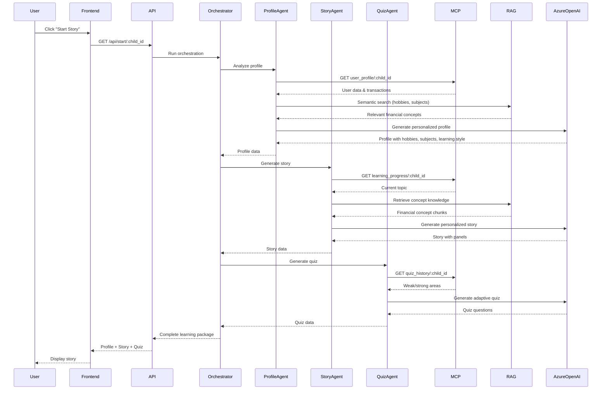
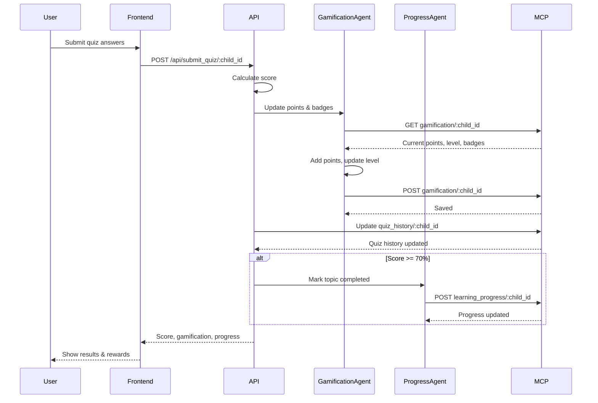
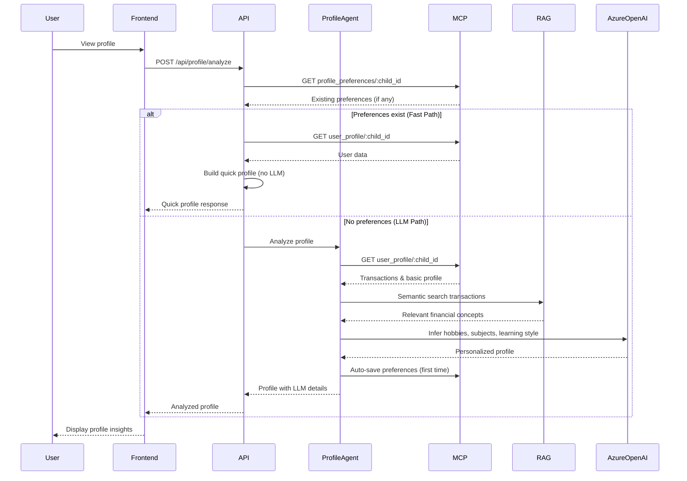

# Financial Education App - Architecture Diagram

## System Architecture Overview

```mermaid
graph TB
    subgraph "Frontend Layer (Angular)"
        UI[User Interface]
        Login[Login Component]
        Home[Home Component]
        Profile[Profile Analysis Component]
        Story[Story Generation Component]
        Quiz[Quiz Component]
        Rewards[Rewards Component]
        Leaderboard[Leaderboard Component]
        Service[User Profile Service]
        
        UI --> Login
        UI --> Home
        UI --> Profile
        UI --> Story
        UI --> Quiz
        UI --> Rewards
        UI --> Leaderboard
        Login --> Service
        Home --> Service
        Profile --> Service
        Story --> Service
        Quiz --> Service
        Rewards --> Service
        Leaderboard --> Service
    end
    
    subgraph "Backend API Layer (FastAPI)"
        API[FastAPI Server<br/>Port 8000]
        LoginEP[POST /api/login]
        StartEP[GET /api/start/:child_id]
        ProfileEP[POST /api/profile/analyze]
        StoryEP[POST /api/story/generate]
        QuizEP[POST /api/quiz/generate]
        SubmitEP[POST /api/submit_quiz/:child_id]
        RewardsEP[GET /api/rewards/:child_id]
        LeaderboardEP[GET /api/leaderboard]
        PrefsEP[GET/POST /api/profile/preferences]
        
        API --> LoginEP
        API --> StartEP
        API --> ProfileEP
        API --> StoryEP
        API --> QuizEP
        API --> SubmitEP
        API --> RewardsEP
        API --> LeaderboardEP
        API --> PrefsEP
    end
    
    subgraph "Agent Layer (Multi-Agent System)"
        Orchestrator[Orchestration Agent]
        ProfileAgent[Profile Agent]
        StoryAgent[Story Agent]
        QuizAgent[Quiz Agent]
        GamificationAgent[Gamification Agent]
        ProgressAgent[Learning Progress Agent]
        
        Orchestrator --> ProfileAgent
        Orchestrator --> StoryAgent
        Orchestrator --> QuizAgent
        Orchestrator --> ProgressAgent
        SubmitEP --> GamificationAgent
        SubmitEP --> ProgressAgent
    end
    
    subgraph "Data Persistence Layer (MCP Server)"
        MCP[MCP Server<br/>Port 5001]
        UserData[User Data<br/>user_data.json]
        ProgressData[Learning Progress<br/>learning_progress.json]
        QuizHistory[Quiz History<br/>quiz_history.json]
        ProfilePrefs[Profile Preferences<br/>profile_preferences.json]
        GamificationData[Gamification Data<br/>gamification.json]
        
        MCP --> UserData
        MCP --> ProgressData
        MCP --> QuizHistory
        MCP --> ProfilePrefs
        MCP --> GamificationData
    end
    
    subgraph "RAG System (Knowledge Base)"
        VectorDB[Chroma Vector Database]
        Embeddings[HuggingFace Embeddings<br/>all-MiniLM-L6-v2]
        PDFs[Source PDFs<br/>Class 6-10 Financial Concepts]
        RAGRetriever[Semantic Retriever]
        
        PDFs --> VectorDB
        Embeddings --> VectorDB
        VectorDB --> RAGRetriever
    end
    
    subgraph "External Services"
        AzureOpenAI[Azure OpenAI<br/>GPT-4o-mini]
        DiceBear[DiceBear Avatars API]
    end
    
    %% Frontend to Backend connections
    Service -->|HTTP REST| API
    
    %% Backend to Agents connections
    StartEP --> Orchestrator
    ProfileEP --> ProfileAgent
    StoryEP --> StoryAgent
    QuizEP --> QuizAgent
    
    %% Agents to MCP connections
    ProfileAgent -->|HTTP| MCP
    StoryAgent -->|HTTP| MCP
    QuizAgent -->|HTTP| MCP
    GamificationAgent -->|HTTP| MCP
    ProgressAgent -->|HTTP| MCP
    
    %% Agents to RAG connections
    ProfileAgent --> RAGRetriever
    StoryAgent --> RAGRetriever
    
    %% Agents to External Services
    ProfileAgent -->|API Calls| AzureOpenAI
    StoryAgent -->|API Calls| AzureOpenAI
    QuizAgent -->|API Calls| AzureOpenAI
    Service -->|Avatar URLs| DiceBear
    
    %% Styling
    classDef frontend fill:#e1f5ff,stroke:#01579b,stroke-width:2px
    classDef backend fill:#f3e5f5,stroke:#4a148c,stroke-width:2px
    classDef agent fill:#fff3e0,stroke:#e65100,stroke-width:2px
    classDef data fill:#e8f5e9,stroke:#1b5e20,stroke-width:2px
    classDef rag fill:#fff9c4,stroke:#f57f17,stroke-width:2px
    classDef external fill:#fce4ec,stroke:#880e4f,stroke-width:2px
    
    class UI,Login,Home,Profile,Story,Quiz,Rewards,Leaderboard,Service frontend
    class API,LoginEP,StartEP,ProfileEP,StoryEP,QuizEP,SubmitEP,RewardsEP,LeaderboardEP,PrefsEP backend
    class Orchestrator,ProfileAgent,StoryAgent,QuizAgent,GamificationAgent,ProgressAgent agent
    class MCP,UserData,ProgressData,QuizHistory,ProfilePrefs,GamificationData data
    class VectorDB,Embeddings,PDFs,RAGRetriever rag
    class AzureOpenAI,DiceBear external
```



## Data Flow Diagrams

### 1. Learning Journey Flow



### 2. Quiz Submission Flow



### 3. Profile Analysis Flow



## Component Architecture

### Frontend Components

```
┌─────────────────────────────────────────────────┐
│              App Component (Root)                │
│  - Navigation routing                            │
│  - LLM call details panel                        │
└─────────────────────────────────────────────────┘
                        │
        ┌───────────────┼───────────────┐
        │               │               │
┌───────▼──────┐ ┌─────▼──────┐ ┌─────▼──────┐
│ Login        │ │ Home       │ │ Profile    │
│ Component    │ │ Component  │ │ Analysis   │
└──────────────┘ └────────────┘ └────────────┘
        │               │               │
        │       ┌───────┼───────┐       │
        │       │       │       │       │
┌───────▼──────┐ │ ┌────▼────┐ │ ┌─────▼──────┐
│ Story        │ │ │ Quiz    │ │ │ Rewards    │
│ Component    │ │ │ Component│ │ │ Component │
└──────────────┘ │ └─────────┘ │ └────────────┘
                 │              │
                 │       ┌───────▼──────┐
                 │       │ Leaderboard  │
                 │       │ Component    │
                 │       └──────────────┘
                 │
        ┌────────▼────────┐
        │ User Profile    │
        │ Service         │
        │ - API calls     │
        │ - State mgmt    │
        └─────────────────┘
```

### Backend Agents

```
┌─────────────────────────────────────────┐
│      Orchestration Agent                │
│  - Coordinates agent pipeline            │
│  - Manages learning journey flow        │
└─────────────────────────────────────────┘
            │
    ┌───────┼───────┐
    │       │       │
┌───▼───┐ ┌─▼───┐ ┌─▼───┐
│Profile│ │Story│ │Quiz │
│Agent  │ │Agent│ │Agent│
└───┬───┘ └─┬───┘ └─┬───┘
    │       │       │
    │   ┌───▼───┐   │
    │   │  RAG  │   │
    │   │System │   │
    │   └───┬───┘   │
    │       │       │
    └───────┼───────┘
            │
    ┌───────▼───────┐
    │  Azure OpenAI │
    │  (LLM Calls)  │
    └───────────────┘

┌─────────────────────────────────────────┐
│      Gamification Agent                 │
│  - Points calculation                   │
│  - Level progression                    │
│  - Badge assignment                     │
└─────────────────────────────────────────┘

┌─────────────────────────────────────────┐
│      Learning Progress Agent             │
│  - Topic tracking                       │
│  - Completion status                    │
│  - Next topic selection                │
└─────────────────────────────────────────┘
```

## Technology Stack

### Frontend
- **Framework**: Angular
- **Language**: TypeScript
- **HTTP Client**: Angular HttpClient
- **Styling**: CSS3 with Flexbox/Grid
- **Avatar Service**: DiceBear Avatars API

### Backend
- **Framework**: FastAPI
- **Language**: Python 3
- **LLM**: Azure OpenAI (GPT-4o-mini)
- **Vector DB**: Chroma
- **Embeddings**: HuggingFace (sentence-transformers/all-MiniLM-L6-v2)
- **Data Storage**: JSON files via MCP Server

### Infrastructure
- **API Server**: Uvicorn (ASGI)
- **MCP Server**: FastAPI (Port 5001)
- **Backend API**: FastAPI (Port 8000)
- **Frontend**: Angular Dev Server (Port 4200)

## Key Design Patterns

1. **Multi-Agent System**: Specialized agents for different tasks
2. **Orchestration Pattern**: Central agent coordinates workflow
3. **RAG (Retrieval-Augmented Generation)**: Semantic search + LLM
4. **Service Layer Pattern**: Frontend service abstracts API calls
5. **Repository Pattern**: MCP Server acts as data repository
6. **Fast Path Optimization**: Skip LLM when preferences exist

## Data Models

### User Profile
```json
{
  "childId": "kid_001",
  "name": "Aarav",
  "age": 12,
  "grade": "6",
  "country": "India",
  "personalization": {
    "hobbies": ["Cricket", "Puzzles"],
    "favoriteSubjects": ["Science", "Mathematics"],
    "preferredLearningStyle": "visual",
    "pocketMoney": {
      "frequency": "weekly",
      "amount": 200,
      "currency": "INR"
    }
  }
}
```

### Learning Progress
```json
{
  "childId": "kid_001",
  "completedTopics": ["Budgeting", "Value Creation"],
  "pendingTopics": ["Entrepreneurship", "Earning Skills"],
  "currentTopic": "Entrepreneurship"
}
```

### Gamification
```json
{
  "childId": "kid_001",
  "points": 4530,
  "level": 46,
  "badges": ["Budgeting Master", "Value Master"]
}
```

## Security & Configuration

- **Environment Variables**: `.env` file for sensitive data
- **CORS**: Configured for frontend-backend communication
- **Authentication**: Username/password validation via MCP
- **API Keys**: Azure OpenAI credentials stored in environment

## Deployment Architecture

```
┌─────────────────────────────────────────┐
│         Production Environment          │
│                                         │
│  ┌──────────────┐    ┌──────────────┐  │
│  │   Frontend   │    │   Backend    │  │
│  │   (Angular)  │◄───┤   (FastAPI)  │  │
│  │              │    │              │  │
│  └──────┬───────┘    └──────┬───────┘  │
│         │                   │          │
│         │            ┌──────▼───────┐  │
│         │            │  MCP Server  │  │
│         │            │  (Data)      │  │
│         │            └──────────────┘  │
│         │                   │          │
│         │            ┌──────▼───────┐  │
│         │            │  Vector DB   │  │
│         │            │  (Chroma)     │  │
│         │            └──────────────┘  │
│         │                   │          │
│         └───────────────────┼──────────┘
│                             │
│                    ┌────────▼────────┐
│                    │  Azure OpenAI   │
│                    │  (External API) │
│                    └─────────────────┘
└─────────────────────────────────────────┘
```

## Performance Optimizations

1. **Fast Path for Profile**: Skip LLM when preferences exist
2. **Caching**: Vector DB caches embeddings
3. **Connection Pooling**: HTTP client reuse
4. **Timeout Management**: 150s timeout for LLM calls
5. **Retry Logic**: 3 attempts with exponential backoff

## Future Enhancements

- [ ] Redis caching layer
- [ ] PostgreSQL for production data storage
- [ ] WebSocket for real-time updates
- [ ] Microservices architecture
- [ ] Kubernetes deployment
- [ ] Monitoring & logging (Prometheus, Grafana)
- [ ] CI/CD pipeline

