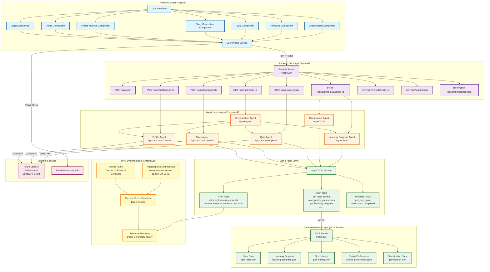
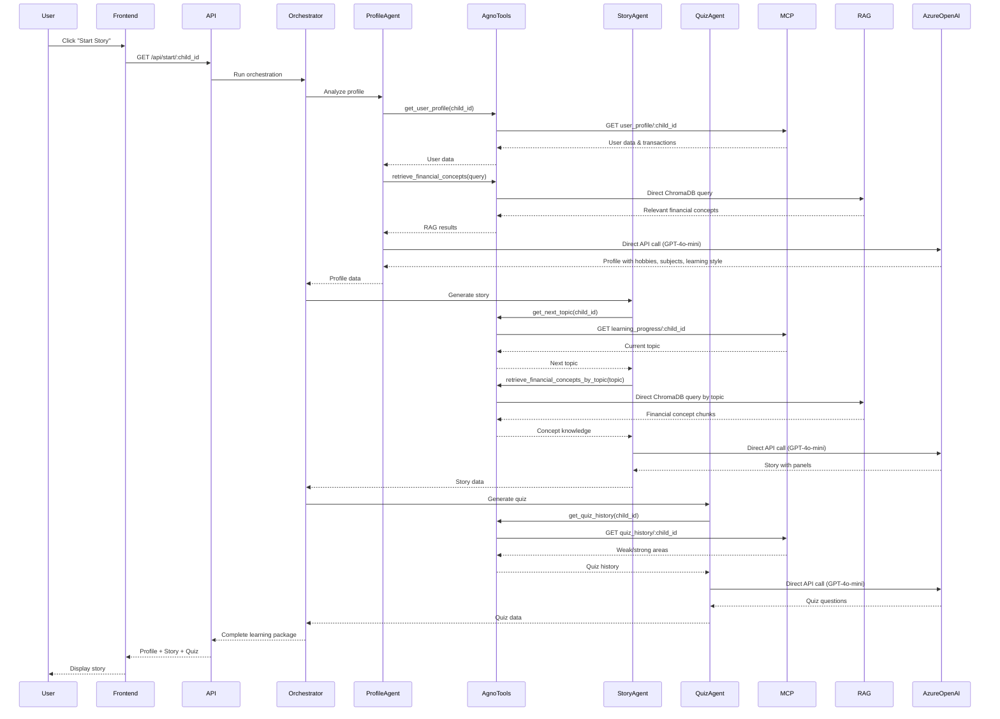
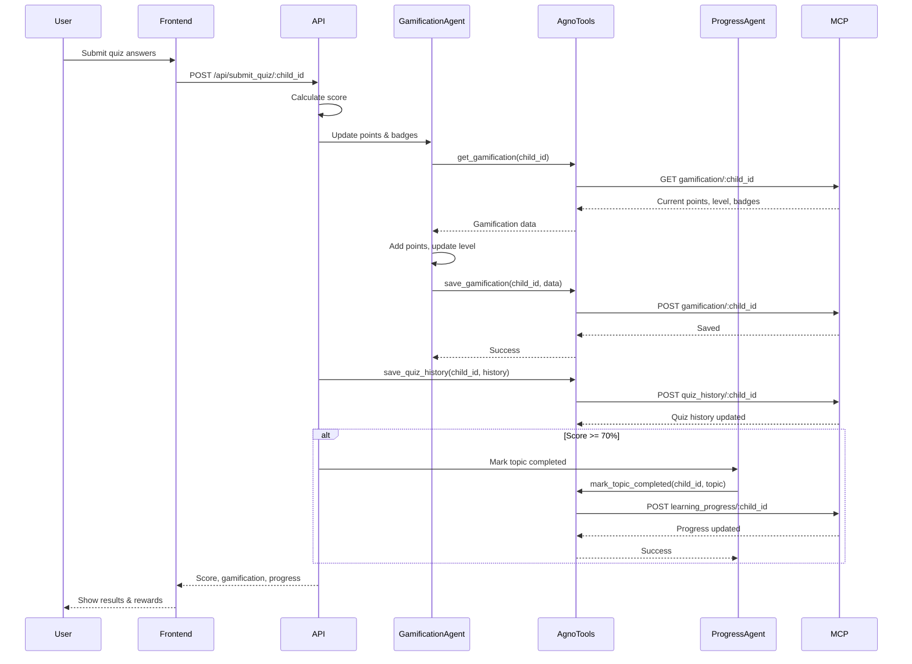
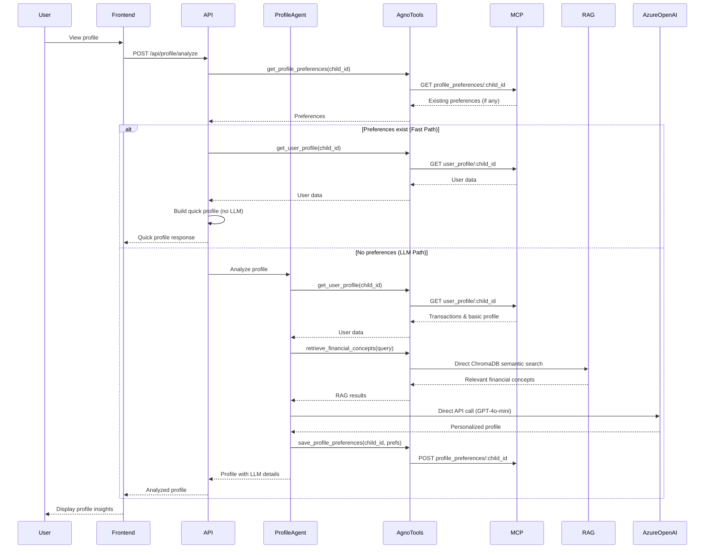
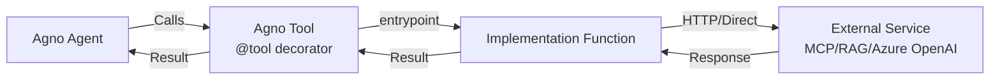

# Financial Education App - Architecture Diagram (Agno Framework)

## System Architecture Overview

## Data Flow Diagrams

### 1. Learning Journey Flow (Agno Framework)

### 2. Quiz Submission Flow

### 3. Profile Analysis Flow (Fast Path)

## Component Architecture

### Agno Tools Architecture

```mermaid
graph TB
    subgraph "Agno Tools Module"
        AgnoTools[agno_tools.py]
        
        subgraph "MCP Tools"
            GetProfile[get_user_profile]
            SavePrefs[save_profile_preferences]
            GetProgress[get_learning_progress]
            SaveProgress[save_learning_progress]
            GetQuiz[get_quiz_history]
            SaveQuiz[save_quiz_history]
            GetGamification[get_gamification]
            SaveGamification[save_gamification]
        end
        
        subgraph "RAG Tools"
            RetrieveConcepts[retrieve_financial_concepts]
            RetrieveByTopic[retrieve_financial_concepts_by_topic]
        end
        
        subgraph "Progress Tools"
            GetNextTopic[get_next_topic]
            MarkCompleted[mark_topic_completed]
        end
        
        AgnoTools --> GetProfile
        AgnoTools --> SavePrefs
        AgnoTools --> GetProgress
        AgnoTools --> SaveProgress
        AgnoTools --> GetQuiz
        AgnoTools --> SaveQuiz
        AgnoTools --> GetGamification
        AgnoTools --> SaveGamification
        AgnoTools --> RetrieveConcepts
        AgnoTools --> RetrieveByTopic
        AgnoTools --> GetNextTopic
        AgnoTools --> MarkCompleted
    end
    
    subgraph "Agents Using Tools"
        ProfileAgent[Profile Agent]
        StoryAgent[Story Agent]
        QuizAgent[Quiz Agent]
        GamificationAgent[Gamification Agent]
        ProgressAgent[Learning Progress Agent]
    end
    
    ProfileAgent --> AgnoTools
    StoryAgent --> AgnoTools
    QuizAgent --> AgnoTools
    GamificationAgent --> AgnoTools
    ProgressAgent --> AgnoTools
```

## Technology Stack

### Frontend
- **Framework**: Angular
- **Language**: TypeScript
- **HTTP Client**: Angular HttpClient
- **Styling**: CSS3 with Flexbox/Grid
- **Avatar Service**: DiceBear Avatars API

### Backend
- **Framework**: FastAPI
- **Language**: Python 3
- **Agent Framework**: Agno
- **LLM**: Azure OpenAI (GPT-4o-mini) - Direct API Client
- **Vector DB**: Chroma (Direct Access, no LangChain)
- **Embeddings**: HuggingFace (sentence-transformers/all-MiniLM-L6-v2)
- **Data Storage**: JSON files via MCP Server

### Infrastructure
- **API Server**: Uvicorn (ASGI)
- **MCP Server**: FastAPI (Port 5001)
- **Backend API**: FastAPI (Port 8000)
- **Frontend**: Angular Dev Server (Port 4200)

## Key Design Patterns

1. **Agno Framework**: All agents and tools use Agno framework
2. **Multi-Agent System**: Specialized agents for different tasks
3. **Orchestration Pattern**: Central agent coordinates workflow
4. **RAG (Retrieval-Augmented Generation)**: Direct ChromaDB + LLM
5. **Service Layer Pattern**: Frontend service abstracts API calls
6. **Repository Pattern**: MCP Server acts as data repository
7. **Fast Path Optimization**: Skip LLM when preferences exist
8. **Tool Pattern**: Agno tools encapsulate MCP and RAG operations

## Agent-Tool Interaction

## Migration from LangChain

- ✅ **Removed**: All LangChain dependencies
- ✅ **Replaced**: LangChain tools → Agno tools
- ✅ **Replaced**: LangChain LLM → Direct Azure OpenAI client
- ✅ **Replaced**: LangChain ChromaDB → Direct ChromaDB access
- ✅ **Added**: Agno framework for agents and tools
- ✅ **Simplified**: Fewer dependencies, cleaner code

## Performance Optimizations

1. **Fast Path for Profile**: Skip LLM when preferences exist
2. **Direct API Calls**: No LangChain overhead
3. **Connection Pooling**: HTTP client reuse
4. **Timeout Management**: 120s timeout for LLM calls
5. **Retry Logic**: 2-3 attempts with exponential backoff
6. **Caching**: Vector DB caches embeddings

