# Financial Education App - System Design Document

## Table of Contents
1. [System Overview](#system-overview)
2. [High-Level System Design](#high-level-system-design)
3. [Component Design](#component-design)
4. [Data Flow Design](#data-flow-design)
5. [API Design](#api-design)
6. [Database/Storage Design](#databasestorage-design)
7. [Scalability & Performance](#scalability--performance)
8. [Security Design](#security-design)
9. [Error Handling & Resilience](#error-handling--resilience)
10. [Deployment Design](#deployment-design)

---

## System Overview

The Financial Education App is a personalized learning platform that uses AI agents to create customized financial education content for children. The system combines RAG (Retrieval-Augmented Generation) with multi-agent orchestration to deliver personalized stories, quizzes, and gamified learning experiences.

### Key Requirements
- **Personalization**: Content tailored to each child's interests, learning style, and progress
- **Scalability**: Support multiple concurrent users
- **Performance**: Fast response times (< 3s for non-LLM operations)
- **Reliability**: Graceful error handling and fallbacks
- **Extensibility**: Easy to add new agents and features

---

## High-Level System Design

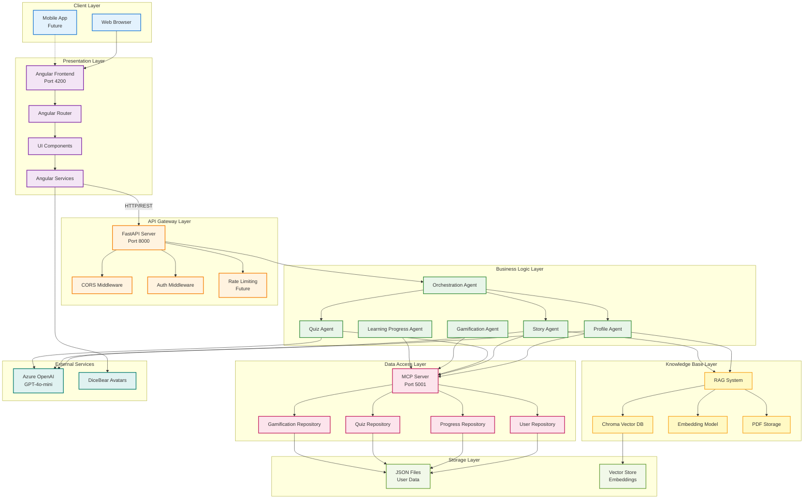

---

## Component Design

### 1. Frontend Component Design

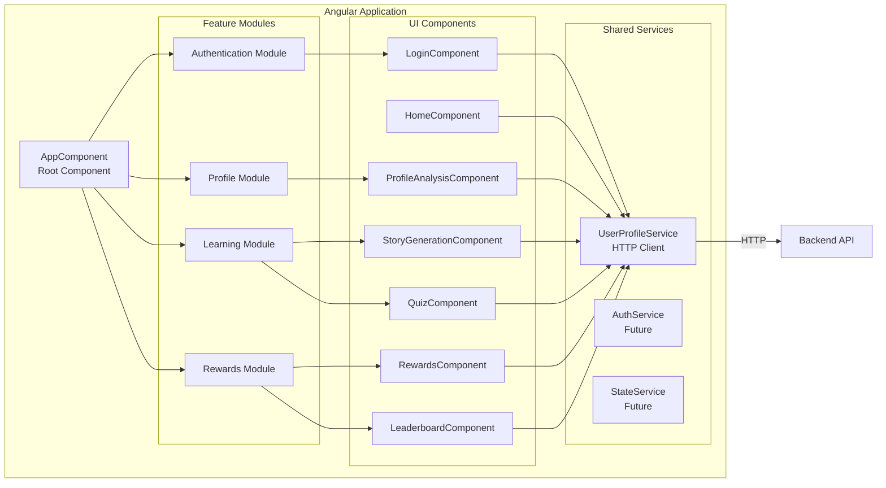

### 2. Backend Agent Design

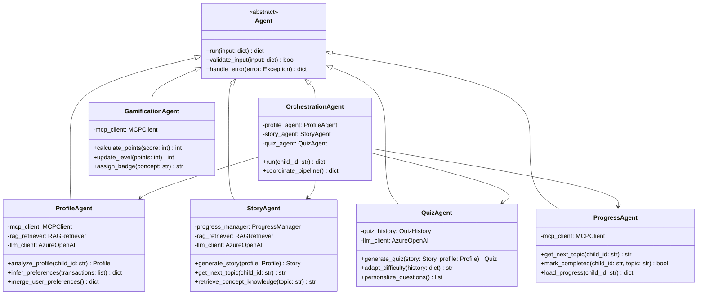

### 3. RAG System Design

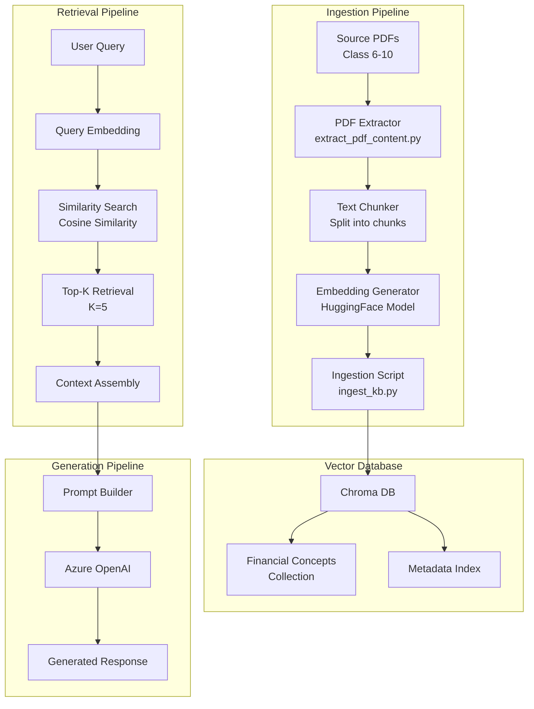

---

## Data Flow Design

### 1. Complete Learning Journey Flow

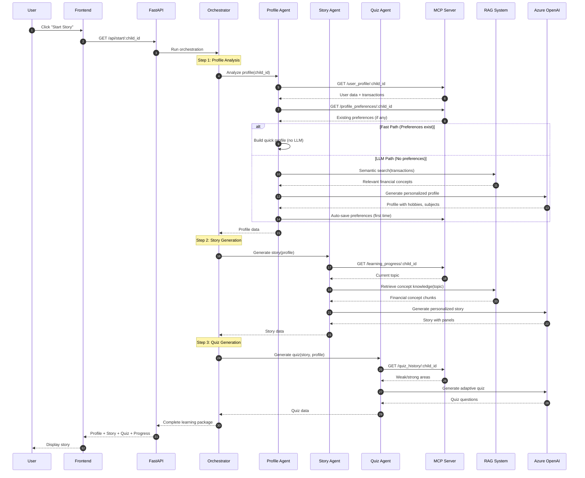

### 2. Quiz Submission & Gamification Flow

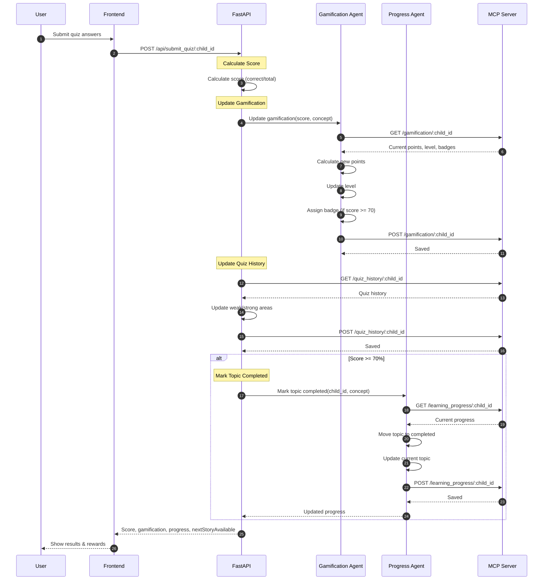

---

## API Design

### API Endpoint Structure

```mermaid
graph TB
    subgraph "Authentication"
        Login[POST /api/login]
    end
    
    subgraph "Learning Journey"
        Start[GET /api/start/:child_id]
        SubmitQuiz[POST /api/submit_quiz/:child_id]
    end
    
    subgraph "Profile Management"
        AnalyzeProfile[POST /api/profile/analyze]
        GetPreferences[GET /api/profile/preferences/:child_id]
        UpdatePreferences[POST /api/profile/preferences]
    end
    
    subgraph "Content Generation"
        GenerateStory[POST /api/story/generate]
        GenerateQuiz[POST /api/quiz/generate]
    end
    
    subgraph "Gamification"
        GetRewards[GET /api/rewards/:child_id]
        GetLeaderboard[GET /api/leaderboard]
    end
    
    API[FastAPI Server] --> Login
    API --> Start
    API --> SubmitQuiz
    API --> AnalyzeProfile
    API --> GetPreferences
    API --> UpdatePreferences
    API --> GenerateStory
    API --> GenerateQuiz
    API --> GetRewards
    API --> GetLeaderboard
```

### API Request/Response Models

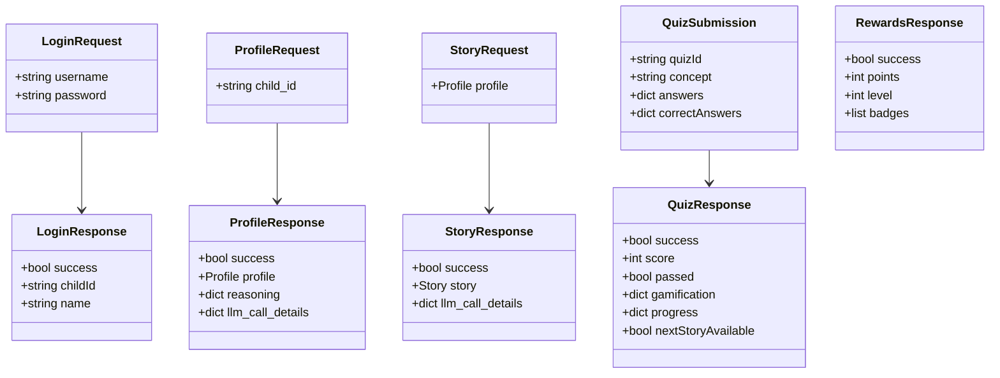

---

## Database/Storage Design

### Data Storage Architecture

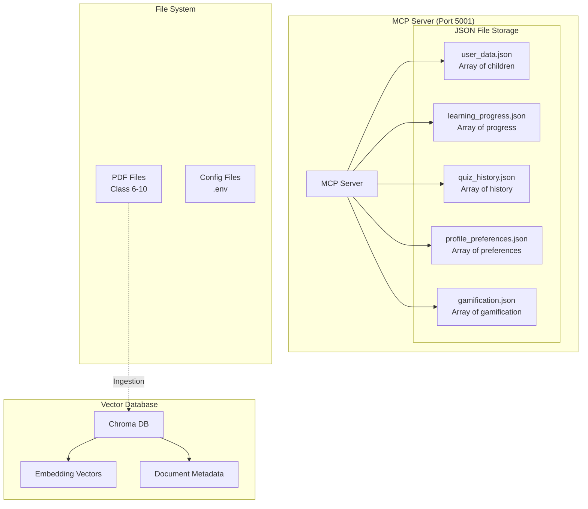

### Data Model Relationships

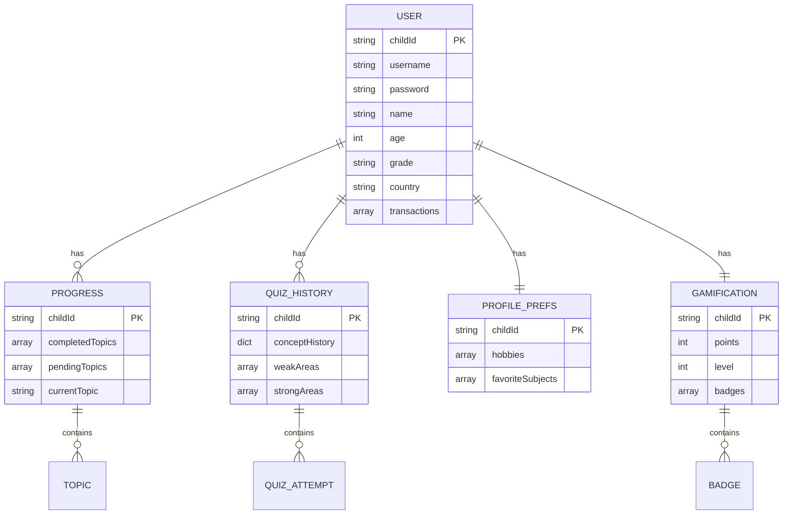

---

## Scalability & Performance

### Performance Optimization Strategies

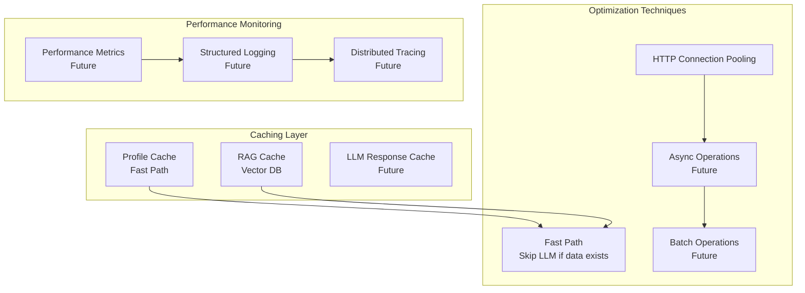

### Scalability Architecture

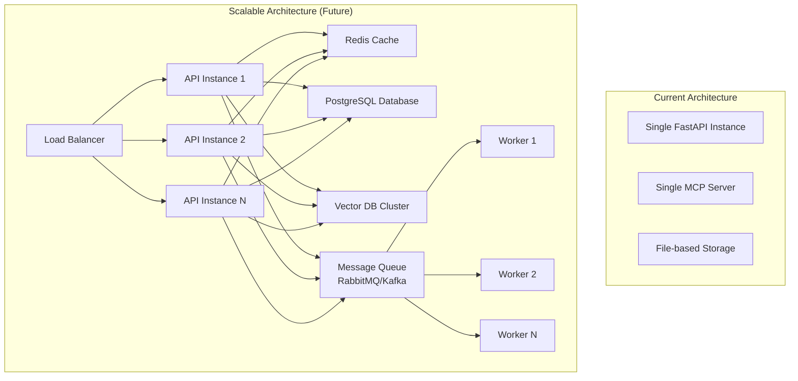

---

## Security Design

### Security Architecture

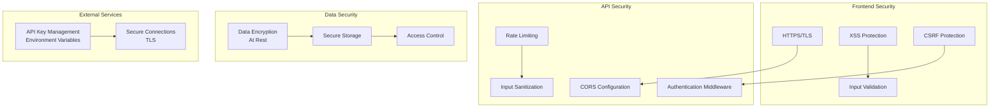

### Authentication Flow

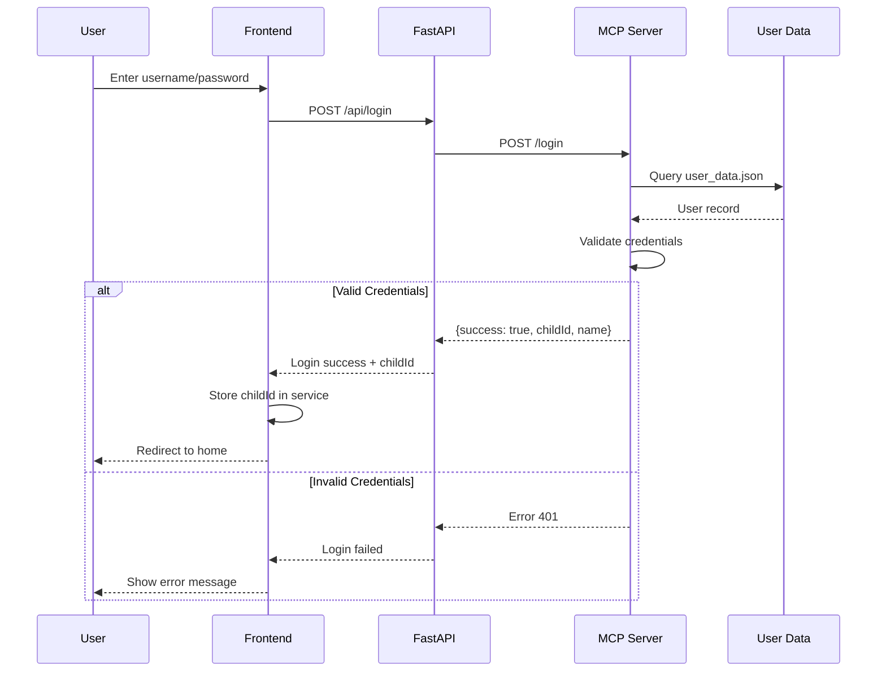

---

## Error Handling & Resilience

### Error Handling Strategy

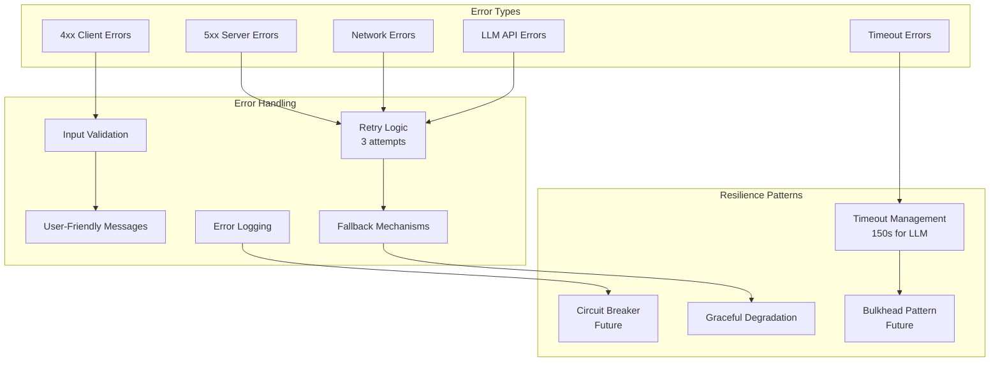

### Retry Strategy

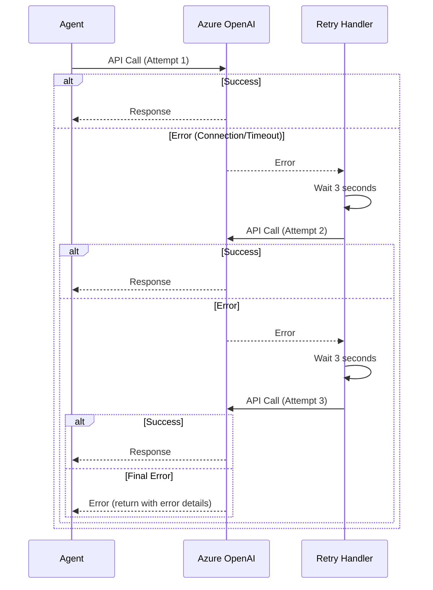

---

## Deployment Design

### Current Deployment Architecture

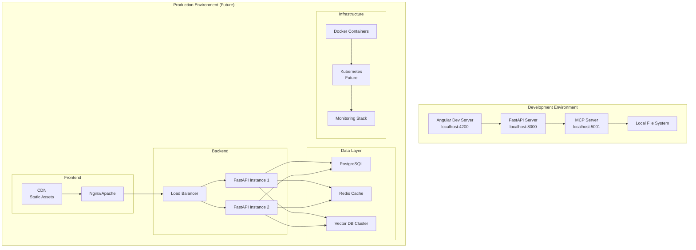

### Container Architecture (Future)

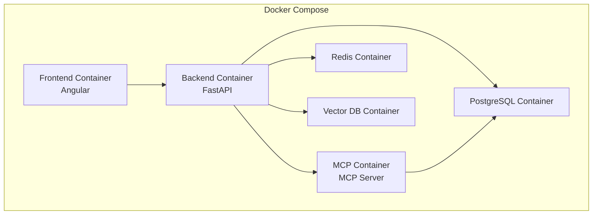

---

## System Metrics & Monitoring (Future)

### Key Performance Indicators

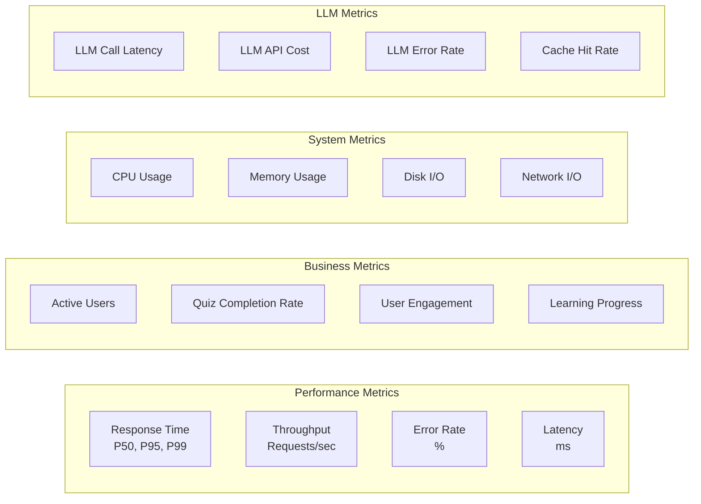

---

## Design Patterns Used

1. **Multi-Agent Pattern**: Specialized agents for different tasks
2. **Orchestration Pattern**: Central coordinator for workflow
3. **Repository Pattern**: MCP Server abstracts data access
4. **Service Layer Pattern**: Frontend services abstract API calls
5. **RAG Pattern**: Retrieval-Augmented Generation for knowledge
6. **Fast Path Pattern**: Optimize common cases
7. **Retry Pattern**: Handle transient failures
8. **Fallback Pattern**: Graceful degradation

---

## Future Enhancements

### Planned Improvements

1. **Caching Layer**
   - Redis for session management
   - Response caching for LLM calls
   - CDN for static assets

2. **Database Migration**
   - PostgreSQL for production data
   - Connection pooling
   - Database replication

3. **Message Queue**
   - Async processing for LLM calls
   - Background job processing
   - Event-driven architecture

4. **Monitoring & Observability**
   - Prometheus for metrics
   - Grafana for dashboards
   - ELK stack for logging

5. **Security Enhancements**
   - JWT tokens for authentication
   - OAuth2 integration
   - Rate limiting per user
   - API versioning

6. **Scalability**
   - Horizontal scaling
   - Auto-scaling based on load
   - Microservices architecture
   - Kubernetes deployment

---

## Conclusion

This system design provides a scalable, maintainable architecture for the Financial Education App. The current implementation focuses on functionality and personalization, while the design includes clear paths for future scalability and production deployment.

